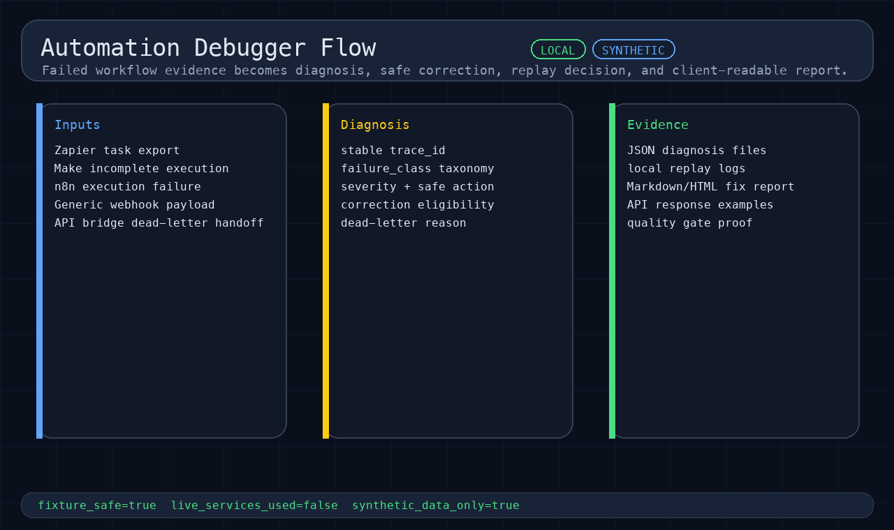
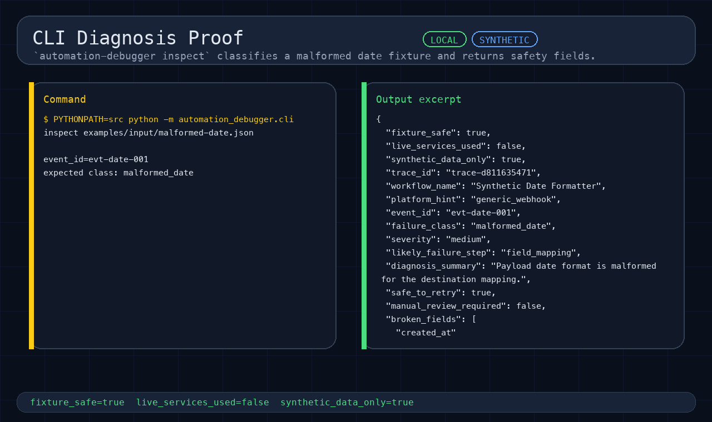
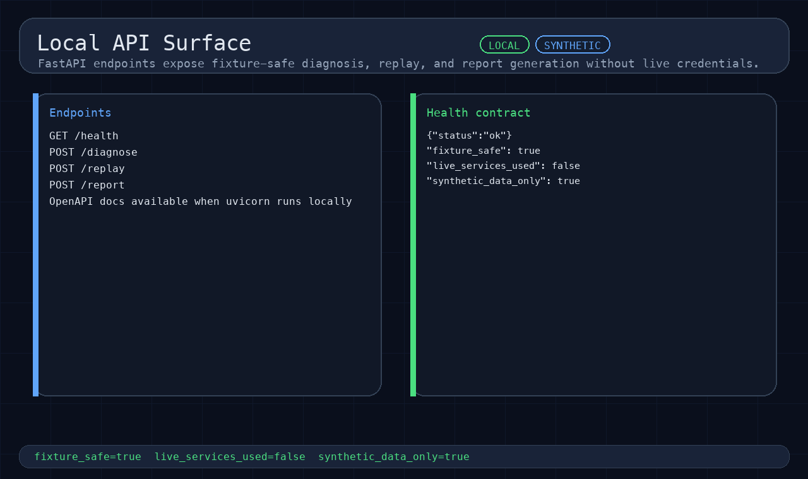
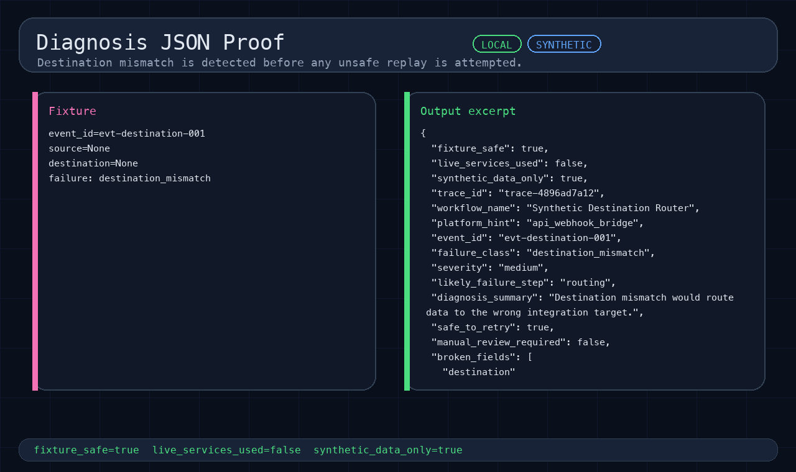
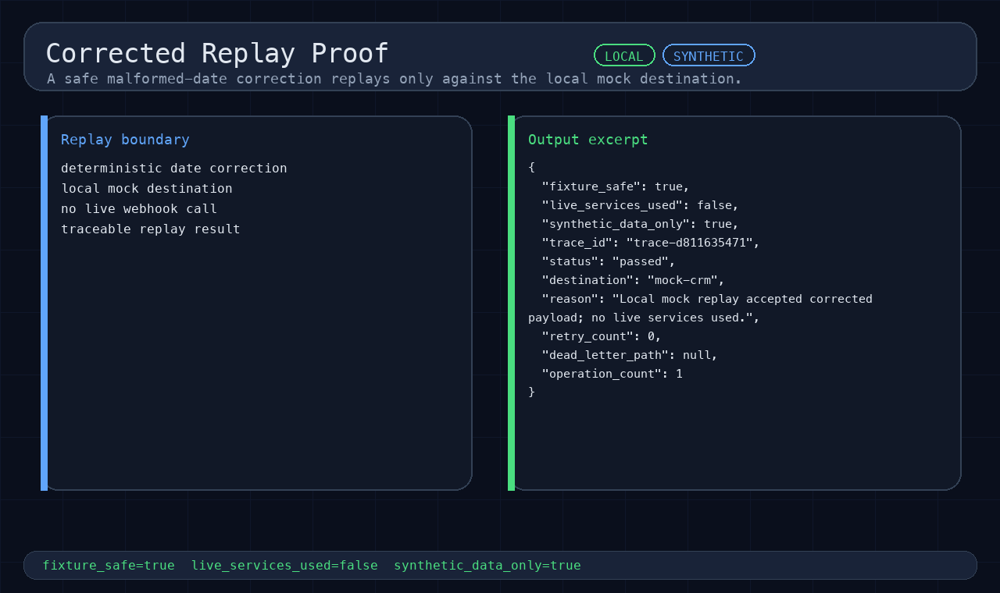
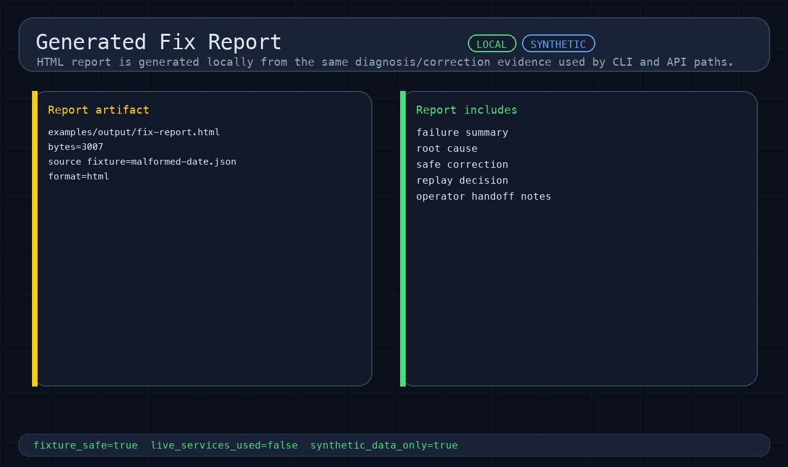
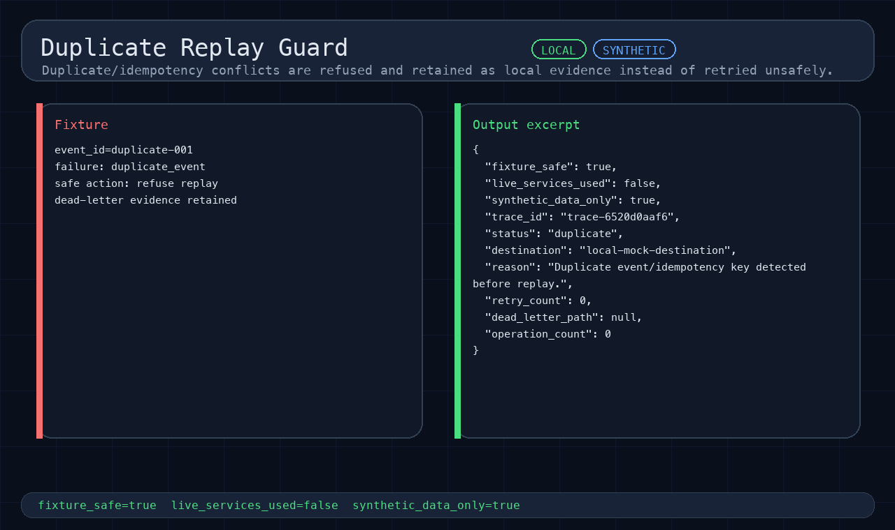
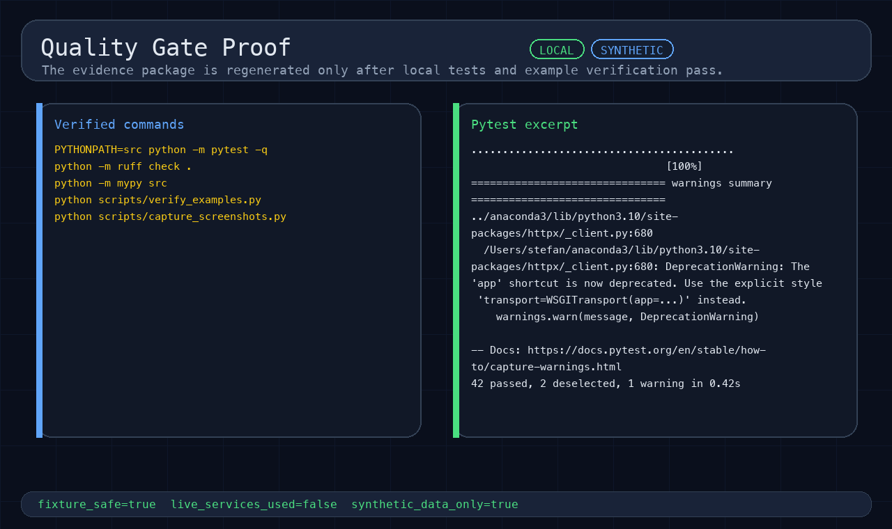

# Automation Debugger

Fixture-safe automation repair/debug proof for diagnosing failed Zapier, Make, n8n, webhook, and API-bridge-style workflow events before any live retry is attempted.

It proves the failure path that complements [`api-webhook-bridge`](https://github.com/stefan-mcf/api-webhook-bridge): receive a broken automation payload, normalize the platform shape, classify the failure, decide whether a safe correction exists, refuse unsafe replay when needed, and generate evidence a reviewer can inspect.

## What it diagnoses locally

This repo uses short, synthetic fixtures instead of live external-service exports. Each case writes a matching `examples/output/diagnosis-*.json` file, with visual proof in the evidence package below.

| Case | Input | Class | Result |
|---|---|---|---|
| Malformed date | `malformed-date` | `malformed_date` | Correct and replay locally. |
| Missing field | `missing-required-field` | `missing_required_field` | Dead-letter input. |
| Duplicate event | `duplicate-event` | `duplicate_event` | Refuse replay; keep trace. |
| Wrong destination | `destination-mismatch` | `destination_mismatch` | Block wrong target. |
| Unknown event | `unknown-event-type` | `unknown_event_type` | Require mapping review. |
| Bad signature | `webhook-invalid-signature` | `invalid_signature` | Refuse replay. |
| Retry storm | `downstream-500-loop` | `downstream_error_loop` | Stop retries locally. |
| Backoff needed | `rate-limit-backoff` | `rate_limit_backoff` | Return retry guidance. |
| Platform exports | Zapier / Make / n8n | normalized evidence | Parse source shape locally. |

All systems are synthetic and local. The project does not call Zapier, Make, n8n, Airtable, Slack, CRM, Google, Shopify, Stripe, cloud services, or any live webhook endpoint.

## Evidence package

Below is the local proof-of-concept evidence for the debugger: failure intake, diagnosis,
safe replay decisions, generated reports, duplicate guards, and quality gates.

[](docs/screenshots/01-flow-overview.png)

[](docs/screenshots/02-cli-proof.png)

[](docs/screenshots/03-openapi-endpoints.png)

[](docs/screenshots/04-diagnosis-output.png)

[](docs/screenshots/05-corrected-replay.png)

[](docs/screenshots/06-fix-report.png)

[](docs/screenshots/07-duplicate-guard.png)

[](docs/screenshots/08-quality-gates.png)

Supporting written evidence:

- Command evidence and local gates: `docs/evidence.md`
- Walkthrough narrative: `docs/sandbox-walkthrough.md`
- Case study: `docs/case-study.md`
- Screenshot guide: `docs/screenshots/README.md`

The screenshots are generated proof panels from synthetic local fixtures. They show no live account screens, credentials, browser tabs, private desktop context, or customer data.

## Run the sandbox walkthrough

```bash
python -m venv .venv
source .venv/bin/activate
pip install -e ".[dev]"

PYTHONPATH=src python -m automation_debugger.cli inspect examples/input/malformed-date.json
PYTHONPATH=src python -m automation_debugger.cli replay examples/input/malformed-date.json
PYTHONPATH=src python -m automation_debugger.cli report examples/input/malformed-date.json --format html --output examples/output/fix-report.html
python scripts/verify_examples.py
```

Useful local checks:

```bash
PYTHONPATH=src python -m pytest -q
python -m ruff check .
python -m mypy src
PYTHONPATH=src python scripts/capture_screenshots.py
```

## Local API proof

```bash
PYTHONPATH=src uvicorn automation_debugger.api:app --host 127.0.0.1 --port 8011
curl -fsS http://127.0.0.1:8011/health
```

Endpoints:

| Endpoint | Purpose |
|---|---|
| `GET /health` | Fixture-safety and service health flags. |
| `POST /diagnose` | Classify a broken event payload and return traceable diagnosis evidence. |
| `POST /replay` | Apply safe correction/replay logic against local mock destinations only. |
| `POST /report` | Generate JSON/Markdown/HTML fix-report content from diagnosis evidence. |

See `docs/api.md` and `examples/api-responses/` for request/response evidence.

## Built on Automation Kit conventions

Automation Kit is the reusable backbone. This repo is the thin repair/debug case study.

Used backbone-style contracts:

- deterministic synthetic fixtures under `examples/input/`;
- typed workflow/event models under `src/automation_debugger/models.py`;
- local mock replay and dead-letter evidence instead of live external-service calls;
- repeatable CLI/API/report outputs under `examples/output/`;
- screenshot and gate evidence under `docs/screenshots/` and `docs/evidence.md`.

See `docs/automation-kit-backbone.md` for the explicit backbone relationship.

## Relationship to API Webhook Bridge

`api-webhook-bridge` proves the green path: validate one approved event, map it into destination-shaped operations, return audit evidence, and stop before live credentials.

`automation-debugger` proves the repair path: inspect failed events, normalize platform exports, identify root cause, decide whether replay is safe, and create fix reports for review.

Together they cover the two common integration milestones:

| Milestone | Repo | Proof |
|---|---|---|
| Build a safe first webhook/API bridge | `api-webhook-bridge` | Valid event -> mapped destination proof -> audit evidence |
| Diagnose and repair a broken automation | `automation-debugger` | Failed event -> diagnosis -> correction/refusal -> replay/report evidence |

## Project docs

| Proof surface | Path |
|---|---|
| Architecture | `docs/architecture.md` |
| Automation Kit relationship | `docs/automation-kit-backbone.md` |
| API Webhook Bridge relationship | `docs/api-webhook-bridge-integration.md` |
| FastAPI notes | `docs/api.md` |
| Sandbox walkthrough | `docs/sandbox-walkthrough.md` |
| Case study | `docs/case-study.md` |
| Command evidence and gates | `docs/evidence.md` |
| Screenshot guide | `docs/screenshots/README.md` |
| Readiness checklist | `docs/public-readiness-checklist.md` |

## Safety boundary

- Fixture-safe synthetic examples only.
- Empty credential placeholders only.
- `fixture_safe: true`, `live_services_used: false`, and `synthetic_data_only: true` are carried through proof outputs.
- Replay uses local mock destinations only.
- Dead-letter evidence is written locally for unsafe events.
- No live external-service calls, customer data, cloud resources, public visibility changes, releases, or external delivery actions are part of this local proof.
- Public release, live external-service proof, credentials, real webhook delivery logs, and cloud deployment remain human-gated.

## Quality gates

```bash
PYTHONPATH=src python -m pytest -q
python -m ruff check .
python -m mypy src
python scripts/verify_examples.py
PYTHONPATH=src python scripts/capture_screenshots.py
git diff --check
```

Current proof status is summarized in `docs/evidence.md` and `docs/public-readiness-checklist.md`.

## Environment

See `.env.example`:

| Variable | Default | Description |
|---|---|---|
| `AUTOMATION_DEBUGGER_USE_LIVE_SERVICES` | `false` | Reserved opt-in gate; live services are not used by this proof. |
| `AUTOMATION_DEBUGGER_MOCK_SEED` | `42` | Deterministic mock/evidence seed. |
| `AUTOMATION_KIT_PATH` | empty | Optional sibling checkout path for relationship docs and local experimentation. |

## Repository layout

```text
src/automation_debugger/
  api.py
  cli.py
  correction.py
  dead_letter.py
  diagnosis.py
  platform_parsers.py
  replay.py
  reports.py
  webhook_safety.py
configs/diagnosis-rules/
  failure-taxonomy.json
  platform-normalization.json
examples/
  input/
  output/
  api-responses/
docs/
  architecture.md
  api.md
  case-study.md
  evidence.md
  screenshots/
scripts/
  capture_screenshots.py
  verify_examples.py
tests/
```

## License

MIT License. See `LICENSE`.
