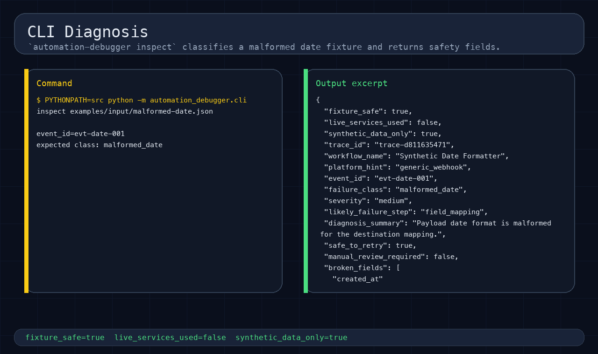

# Automation Debugger

Diagnose failed Zapier, Make, n8n, webhook, and API workflows before a retry creates duplicate or incorrect downstream work.

[Read the full project story](https://smsystems.au/work/automation-debugger/) · [Review the architecture](docs/architecture.md) · [Run the walkthrough](#run-the-worked-example)

## Why this exists

A failed automation rarely arrives with a clean root cause. It usually arrives as a provider export, a payload, a partial error message, and a request to run it again.

That is risky when:

- one destination may have processed the event already;
- provider exports use different field shapes;
- the original payload has a malformed or missing value;
- a signature is invalid;
- retries are already looping;
- the event is pointed at the wrong destination.

Automation Debugger separates diagnosis from replay. It normalizes the input, assigns a trace ID, classifies the failure, and decides whether a corrected local replay is safe. Duplicate, invalid-signature, and already-applied events stop with a structured refusal and zero destination operations.

## What it does

```text
Provider export or webhook fixture
              │
              ▼
      Normalize the event
              │
              ▼
      Classify the failure
              │
              ▼
       Evaluate replay risk
          ┌───┴────┐
          ▼        ▼
   local replay   refusal
          └───┬────┘
              ▼
    diagnosis and handover
```

The same contracts and safety rules are available through:

- a Typer CLI for inspection, replay, and report generation;
- a FastAPI service for integration into a larger diagnostic workflow;
- JSON, Markdown, and HTML outputs for engineering handover;
- committed fixtures for repeatable failure scenarios.

## Failure classes

| Scenario | Classification | Action |
| --- | --- | --- |
| Malformed date | `malformed_date` | Correct the deterministic field and replay locally. |
| Missing required field | `missing_required_field` | Stop and write a dead-letter record. |
| Duplicate event | `duplicate_event` | Refuse replay and retain the trace. |
| Wrong destination | `destination_mismatch` | Block the target and require mapping review. |
| Unknown event type | `unknown_event_type` | Stop until an explicit mapping exists. |
| Invalid signature | `invalid_signature` | Refuse replay. |
| Downstream error loop | `downstream_error_loop` | Stop repeated attempts locally. |
| Rate limit | `rate_limit_backoff` | Return bounded retry guidance. |
| Provider export | platform normalization | Convert Zapier, Make, and n8n shapes into the common event contract. |

## Worked failure path

The committed `malformed-date` case shows the complete path:

1. Inspect a failed event and assign its trace ID.
2. Classify the malformed date without changing the original input.
3. Apply the deterministic correction.
4. Re-evaluate idempotency and destination safety.
5. Replay against the local adapter.
6. Generate the diagnosis, replay record, and handover report.

The duplicate case follows the same intake path but exits with a replay refusal. That distinction is deliberate: a technically valid payload can still be unsafe to repeat.

## Screenshots

[](docs/screenshots/01-flow-overview.png)

[](docs/screenshots/02-cli-diagnosis.png)

[](docs/screenshots/03-openapi-endpoints.png)

[](docs/screenshots/07-duplicate-guard.png)

The images are generated from the committed local cases. They contain no provider account screens, customer data, credentials, browser tabs, or private desktop context.

<details>
<summary>Additional implementation screens</summary>

[](docs/screenshots/04-diagnosis-output.png)

[](docs/screenshots/05-corrected-replay.png)

[](docs/screenshots/06-fix-report.png)

[](docs/screenshots/08-quality-gates.png)

</details>

## Run the worked example

Python 3.11 or newer is recommended.

```bash
uv venv --python 3.11 .venv
source .venv/bin/activate
uv pip install -e ".[dev]"
```

Inspect, replay, and report:

```bash
PYTHONPATH=src python -m automation_debugger.cli inspect examples/input/malformed-date.json
PYTHONPATH=src python -m automation_debugger.cli replay examples/input/malformed-date.json
PYTHONPATH=src python -m automation_debugger.cli report \
  examples/input/malformed-date.json \
  --format html \
  --output examples/output/fix-report.html
```

Check every committed input and expected output:

```bash
python scripts/verify_examples.py
```

## CLI

```bash
PYTHONPATH=src python -m automation_debugger.cli --help
```

Core commands:

| Command | Purpose |
| --- | --- |
| `inspect` | Normalize an event and return a deterministic diagnosis. |
| `replay` | Apply an allowed correction and run the local destination adapter. |
| `report` | Render the diagnosis and replay decision as JSON, Markdown, or HTML. |

## API

Start the local service:

```bash
PYTHONPATH=src uvicorn automation_debugger.api:app --host 127.0.0.1 --port 8011
curl -fsS http://127.0.0.1:8011/health
```

| Endpoint | Purpose |
| --- | --- |
| `GET /health` | Report local service and safety configuration. |
| `POST /diagnose` | Classify an event and return its traceable diagnosis. |
| `POST /replay` | Apply the same correction and refusal rules used by the CLI. |
| `POST /report` | Generate JSON, Markdown, or HTML report content. |

Request and response examples live in [`examples/api-responses/`](examples/api-responses/). Additional API notes are in [`docs/api.md`](docs/api.md).

## Outputs

Every run can produce:

- normalized event data;
- a failure classification and severity;
- the affected fields and root cause;
- a proposed correction when one is deterministic;
- a replay success or refusal record;
- destination-operation accounting;
- a local dead-letter record when processing must stop;
- a readable engineering handover.

This makes the next decision inspectable without requiring another engineer to reconstruct the original run.

## Architecture

```text
src/automation_debugger/
├── platform_parsers.py  # Zapier, Make, n8n, and webhook normalization
├── diagnosis.py         # deterministic classification
├── correction.py        # bounded field correction
├── idempotency.py       # replay refusal and duplicate checks
├── replay.py            # local destination adapters
├── dead_letter.py       # stopped-event records
├── reports.py           # JSON, Markdown, and HTML output
├── cli.py               # Typer interface
└── api.py               # FastAPI interface
```

Configuration under [`configs/diagnosis-rules/`](configs/diagnosis-rules/) keeps the failure taxonomy and platform normalization mappings separate from the execution code.

## Engineering decisions

### Deterministic classification

The same input and configuration produce the same failure class and recommended action. Replay safety does not depend on an opaque model score.

### Refusal is a valid result

Duplicate, invalid-signature, and already-applied events produce a structured refusal. The tool does not treat an attempted write as the definition of success.

### Input remains immutable

The original event is retained. Corrections are written as a separate candidate payload so the change can be reviewed and compared.

### Destination operations are counted

A replay record reports the destination operations it would produce. Refused cases assert zero operations, which makes duplicate protection testable.

## Validation

```bash
PYTHONPATH=src python -m pytest -q
python -m ruff check .
python -m mypy src
python scripts/verify_examples.py
PYTHONPATH=src python scripts/capture_screenshots.py
git diff --check
```

The current suite covers normalization, classification, correction, replay, refusal, reporting, API behavior, committed examples, and screenshot generation.

## Operating boundary

The included examples use synthetic local data and local destination adapters. The project does not sign in to Zapier, Make, n8n, Airtable, a CRM, or another provider. It does not modify production workflows or replay customer events.

That boundary keeps the repository reproducible. A real incident response would add an approved provider adapter, scoped credentials, a sanitized event, and a separate live-change review.

## Related repositories

- [API Webhook Bridge](https://github.com/stefan-mcf/api-webhook-bridge) covers validated intake, mapping, idempotency, and dead-letter handling on the green path.
- [Sheets Airtable Sync](https://github.com/stefan-mcf/sheets-airtable-sync) covers reconciliation, data quality, and exception routing after intake.

## License

MIT License. See [`LICENSE`](LICENSE).
