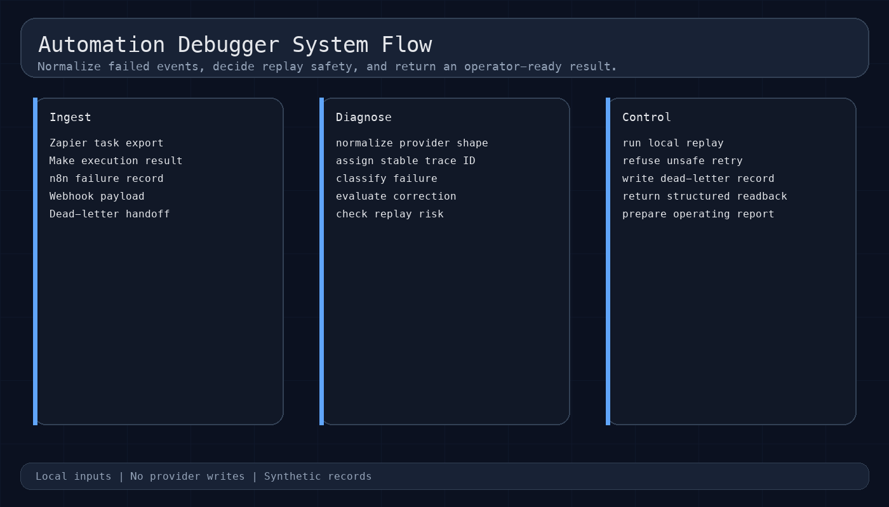
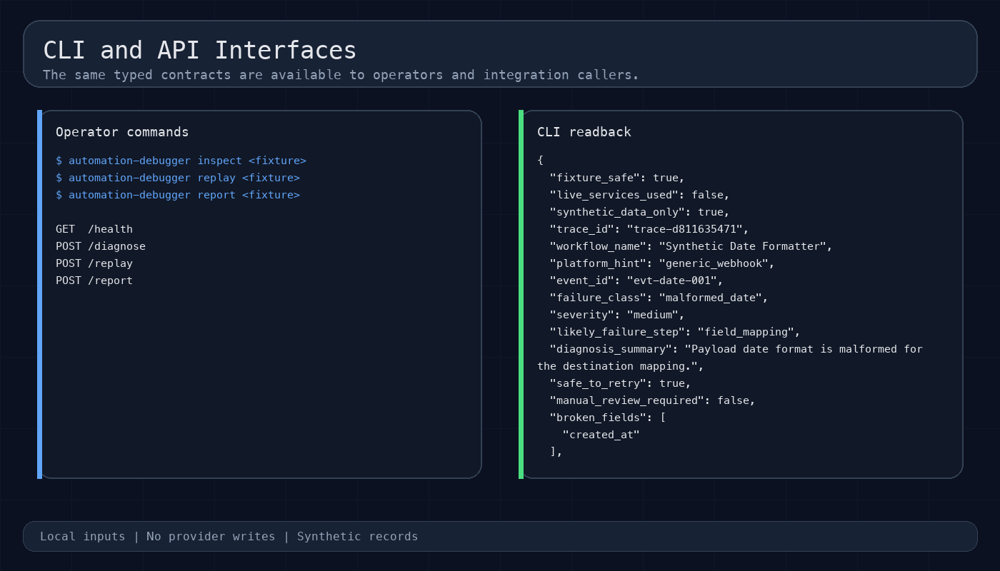
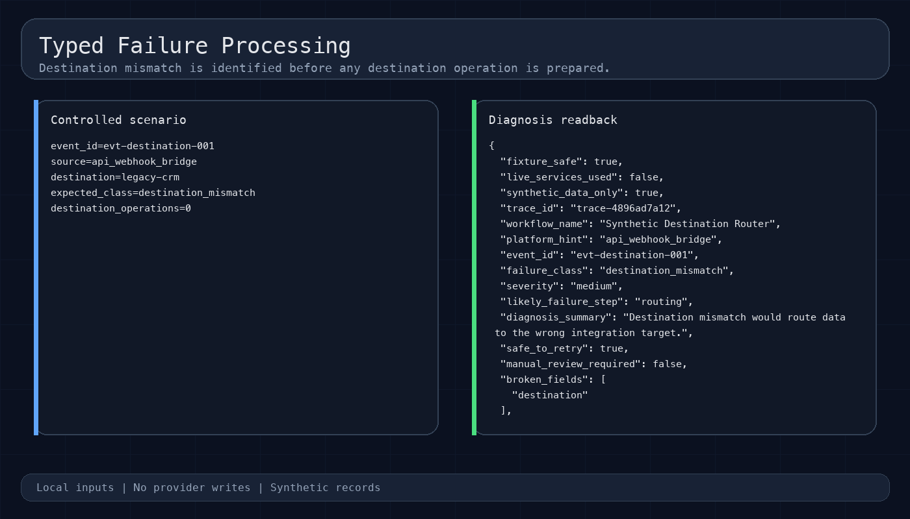
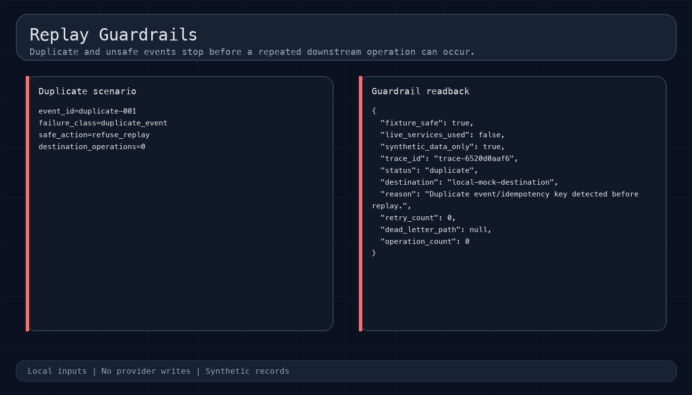
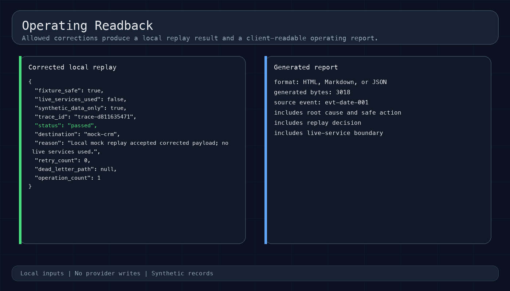
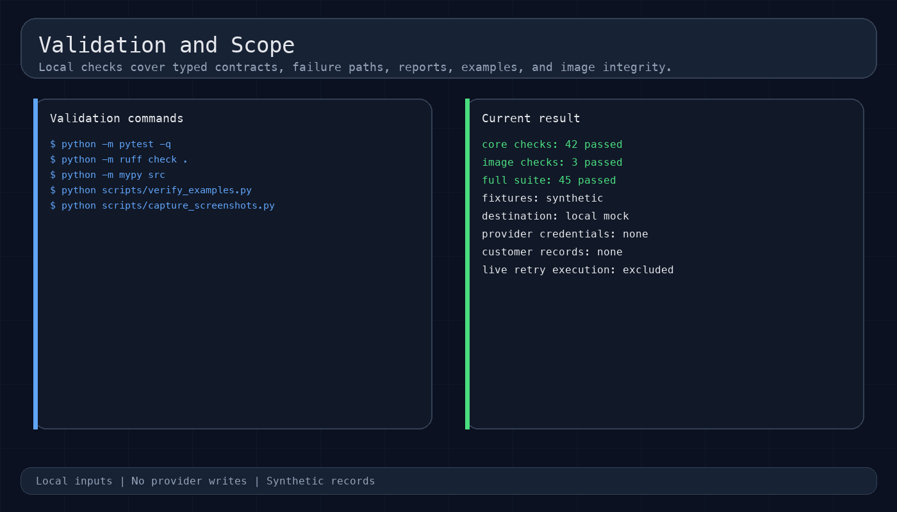

# Automation Debugger

Diagnose failed Zapier, Make, n8n, webhook, and API workflows before a retry creates duplicate or incorrect downstream work.

[Case study](docs/case-study.md) | [Architecture](docs/architecture.md) | [API reference](docs/api.md)

## Overview

**Role:** failure taxonomy, diagnosis and replay controls, CLI/API implementation and tests. **Status:** an SM Systems reference tool with deterministic local scenarios and mock destinations.

Automation Debugger separates diagnosis from replay. It normalizes provider-shaped input, assigns a stable trace ID, classifies the failure, proposes deterministic corrections, and decides whether a local replay is safe.

Duplicate events, invalid signatures, missing required fields, unknown event types, and repeated downstream errors stop with structured operator guidance. Safe corrections run only against the local mock destination.

## Capabilities

- Normalizes Zapier, Make, n8n, and generic webhook failure exports.
- Classifies ten success and failure states through a typed taxonomy.
- Applies deterministic field corrections without mutating the source fixture.
- Blocks duplicate, invalid-signature, and unsafe retry paths.
- Writes local dead-letter records for repeated downstream failures.
- Produces JSON, Markdown, and HTML operating reports.
- Exposes the same contracts through a Typer CLI and FastAPI service.

## Operating flow

```text
Provider export or webhook fixture
              |
              v
      Normalize the event
              |
              v
      Classify the failure
              |
              v
       Evaluate replay risk
          /        \
         v          v
   local replay   refusal
          \        /
           v      v
     operating report
```

The source fixture remains unchanged. A corrected payload is evaluated separately, and every replay result includes the trace ID, destination boundary, operation count, and safety fields.

## Interfaces

### CLI

| Command | Purpose |
| --- | --- |
| `inspect` | Normalize an event and return its typed diagnosis. |
| `replay` | Apply an allowed correction and run the local destination adapter. |
| `report` | Render the diagnosis and replay decision as JSON, Markdown, or HTML. |

```bash
PYTHONPATH=src python -m automation_debugger.cli --help
PYTHONPATH=src python -m automation_debugger.cli inspect examples/input/malformed-date.json
PYTHONPATH=src python -m automation_debugger.cli replay examples/input/malformed-date.json
```

### API

| Method | Path | Purpose |
| --- | --- | --- |
| `GET` | `/health` | Return service and safety configuration. |
| `POST` | `/diagnose` | Classify one event. |
| `POST` | `/replay` | Evaluate and run one allowed local replay. |
| `POST` | `/report` | Return a client-readable operating report. |

```bash
PYTHONPATH=src uvicorn automation_debugger.api:app --host 127.0.0.1 --port 8011
curl -fsS http://127.0.0.1:8011/health
```

## System views

### System flow

[](docs/screenshots/01-system-flow.png)

### Interface surface

[](docs/screenshots/02-interface-surface.png)

### Core processing

[](docs/screenshots/03-core-processing.png)

### Guardrail and failure path

[](docs/screenshots/04-replay-guardrail.png)

### Output and readback

[](docs/screenshots/05-operating-readback.png)

### Validation and scope

[](docs/screenshots/06-validation-scope.png)

The images are generated from committed local scenarios. They contain no provider account screens, customer records, credentials, browser chrome, or private desktop paths.

## Run locally

Python 3.11 is the reference runtime.

```bash
uv venv --python 3.11 .venv
source .venv/bin/activate
uv pip install -e ".[dev]"
```

Generate a local report:

```bash
PYTHONPATH=src python -m automation_debugger.cli report \
  examples/input/malformed-date.json \
  --format html \
  --output /tmp/automation-debugger-report.html
```

## Validation

The repository includes repeatable fixtures for malformed data, missing fields, duplicate events, destination mismatch, unknown event types, invalid signatures, downstream error loops, and rate limiting.

```bash
python -m pytest -q
python -m ruff check .
python -m mypy src
python scripts/verify_examples.py
```

## Scope boundaries

- Synthetic fixtures and local mock destinations only.
- No provider credentials or customer records.
- No live webhook delivery or downstream API calls.
- No production retry execution.
- Live connections require scoped credentials, sanitized samples, durable storage, monitoring, and explicit operator approval.

Every diagnosis and replay response declares:

```text
fixture_safe=true
live_services_used=false
synthetic_data_only=true
```

## Project documentation

| Document | Purpose |
| --- | --- |
| [Case study](docs/case-study.md) | Engineering decisions, representative paths, and production extension. |
| [Architecture](docs/architecture.md) | Component boundaries and data flow. |
| [API reference](docs/api.md) | Local endpoints and request contracts. |
| [Local operation](docs/local-operation.md) | Repeatable CLI, API, and report commands. |
| [Validation record](docs/validation.md) | Commands, fixtures, and checked boundaries. |
| [Image index](docs/screenshots/README.md) | Functional image sequence and generation command. |

## License

MIT. See [LICENSE](LICENSE).
